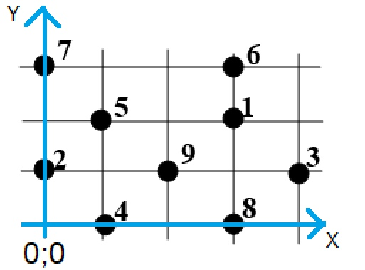

# Нахождение минимального связывающего дерева. Алгоритм Краскала

## Инструкция
Необходимо ввести координаты каждой вершины из варианта в файл input, который находится в директории cmake-build-debug. \
**ВАЖНО!** Вводите точки в порядке нумерации из вашего варианта.
Точки вводятся по одной в строке в формате: "x y" (без ковычек)\
Координаты считать от нижней левой точки, как на примере ниже. \
 \
Пример содержимого файла input для данного примера: 
```
3 2
0 1
4 1
1 0
1 2
3 3
0 3
3 0
2 1
```
После ввода варианта - запустить программу.\
Ответ будет выведен в подобном формате:
```
{e1; e6}
{e1; e3}
{e8; e9}
{e5; e9}
{e5; e7}
{e4; e9}
{e3; e9}
{e2; e9}
```

Здесь каждая фигурная скобка - ребро, соединяющее 2 вершины. Номера вершин соответствуют их порядковому номеру во входном файле.